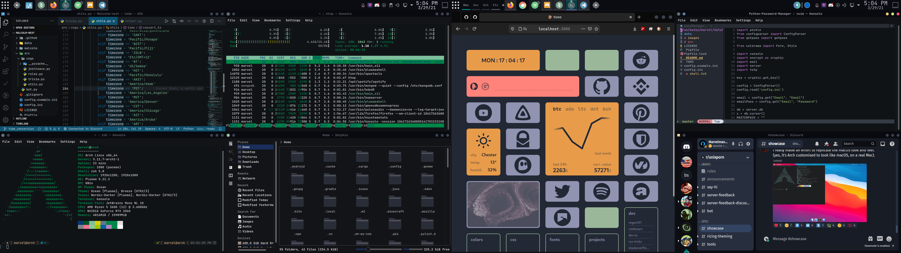
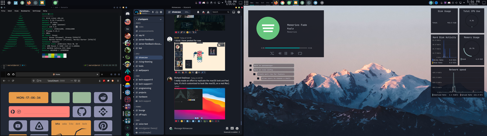
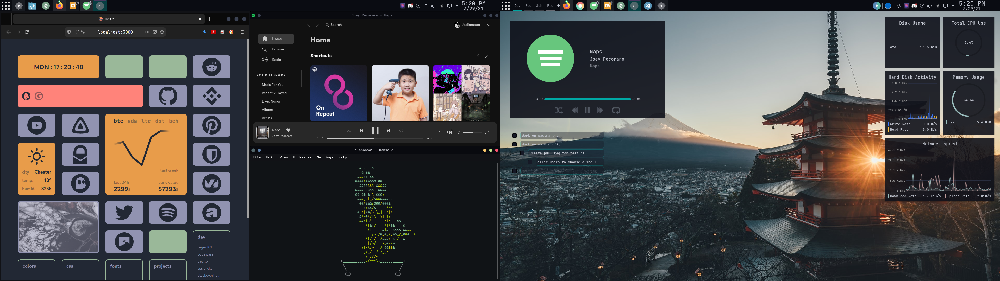

# My dots
> The customization files for my Arch Linux system.

**All the files here are are built around my system, there is no guarentee that they will work on yours, should you choose to copy them.**

## Screenshots

Leftmost monitor: 
  - top left: vscode
  - bottom left: neofetch
  - top right: htop
  - bottom right: dolphin

Rightmost monitor: 
  - left half: firefox 
  - top right: nvim 
  - bottom right: discord

Leftmost monitor: 
  - top left: neofetch 
  - bottom left: firefox
  - right half: discord

Leftmost monitor: 
  - left half: firefox 
  - top right: spotify 
  - bottom right: cbonsai

## Stuff

### Vscode
  - #### Extensions
    - [Discord Presence](https://marketplace.visualstudio.com/items?itemName=icrawl.discord-vscode)
    - [Bracket Pair Colorizer 2](https://marketplace.visualstudio.com/items?itemName=CoenraadS.bracket-pair-colorizer-2)
    - [GitHub](https://marketplace.visualstudio.com/items?itemName=KnisterPeter.vscode-github)
    - [GitLens - Git supercharged](https://marketplace.visualstudio.com/items?itemName=eamodio.gitlens)
    - [Kite AutoComplete AI Code](https://marketplace.visualstudio.com/items?itemName=kiteco.kite)
    - [Material Icon Theme](https://marketplace.visualstudio.com/items?itemName=PKief.material-icon-theme)
    - [Black Ocean Theme](https://marketplace.visualstudio.com/items?itemName=zamerick.black-ocean)
    - [Prettier - Code formatter](https://marketplace.visualstudio.com/items?itemName=esbenp.prettier-vscode)
    - [Python](https://marketplace.visualstudio.com/items?itemName=ms-python.python)
    - [Kotlin](https://marketplace.visualstudio.com/items?itemName=mathiasfrohlich.Kotlin)
    - [TODO+](https://marketplace.visualstudio.com/items?itemName=fabiospampinato.vscode-todo-plus)
    - [TODO Highlight](https://marketplace.visualstudio.com/items?itemName=wayou.vscode-todo-highlight)

### Nvim
  - Neovim dotfiles [here](https://github.com/siduck76/neovim-dots)
### Konsole
  - Color Schemes can be found in `.local/share/konsole`
### Widgets
  - #### Desktop
    - Stock KDE Media Player
    - [TodoList](https://store.kde.org/p/1152230/)
    - Stock KDE System Monitor Widgets
  - #### Bar
    - Stock KDE Application Launcher
    - [Virtual Desktop Bar](https://www.pling.com/p/1315319)
    - Stock KDE Icons-only Task Manager
    - Stock KDE Color Picker
    - [Event Calendar](https://www.pling.com/p/998901)
    - Stock KDE Show Desktop
### KDE
  - #### Global Theme
    - [Ocean](https://store.kde.org/p/1427580/)
  - #### Plasma Style
    - [Ocean](https://store.kde.org/p/1427580/)
  - #### Color Scheme
    - [Customized](https://github.com/marvelman3284/dotfiles/blob/master/.local/share/color-schemes/Carl.colors) [Carl](https://store.kde.org/p/1331616/)
  - #### Window Decorations
    - [Ocean](https://store.kde.org/p/1427580/)
  - #### Fonts
    - [JetBrains Mono](https://www.jetbrains.com/lp/mono/)
  - #### Icons
    - [Nordic Darker](https://store.kde.org/p/1327093/)
  - #### Cursors
    - Stock KDE Breeze Cursors

### Discord
  - #### Theme/Plugin Manager
    - [Powercord](https://powercord.dev)
  - #### Plugins
    - Only the stock [Powercord](https://powercord.dev) ones
  - #### Themes
    - [midnightcord](https://github.com/spinfish/midnightcord)
    - [deepbluetheme](https://github.com/OnScreenProton/deepbluetheme)
  
  >>> Although the folder is named `discord` you shouldn't place the theme folders inside of your discord folder. The files belong in `/directory/where/powercord-is-installed/src/Powercord/themes/`

## Release History

* 0.0.1
    * First batch of commits that contain my main dotfiles - *29/03/2021*

## Credits
[Neovim configs from @Siduck76](https://github.com/siduck76/neovim-dots)
[Firefox theme, blurredfox, from @manilarome](https://github.com/manilarome/blurredfox)
Idea to make `~` a git repo from [@XECortex](https://github.com/XECortex/dots) who got the idea from [@phisch](https://github.com/phisch/dotfiles)

## Meta

Jeevan Shah – [@marvelman3284](https://twitter.com/marvelman3284) – jeevandshah@gmail.com

Distributed under the GPL-3.0 license. See ``LICENSE`` for more information.

[https://github.com/marvelman3284/](https://github.com/marvelman3284/)

## Contributing

1. Fork it (<https://github.com/yourname/yourproject/fork>)
2. Create your feature branch (`git checkout -b feature/fooBar`)
3. Commit your changes (`git commit -am 'Add some fooBar'`)
4. Push to the branch (`git push origin feature/fooBar`)
5. Create a new Pull Request
